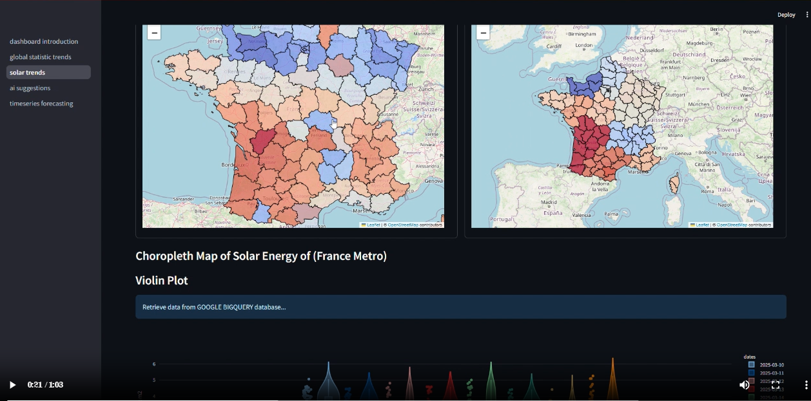

# **Streamlit Dashboard Connected to ClickHouse Database via API REST**
[](https://streamlit.io/)
[](https://fastapi.tiangolo.com/)
[](https://www.visualcrossing.com/)
[](https://openrouter.ai/)
[](https://deepseek.com/)
[](https://www.docker.com/)


This Project aims to create dashboard to visualize all interesting charts that can help weather team on seven next days and that every day you.
Below an example of what you can do with app. You will be able to get suggestion from AI Agent named ``AgentSunAI``.

[](https://donat-konan33.github.io/assets/videos/demo.mp4)

Click the image above to watch a brief demo of the Streamlit dashboard. The video highlights interactive charts generated from aggregated database values and demonstrates how AgentSunAI offers suggestions on energy consumption, tailored to the projected energy density for each region or department over the next seven days.

---
## **Local Installation**

### 1. Clone the repository:
```bash
git clone https://github.com/donat-konan33/ClickHouseWeatherAnalyticsDashboard.git
cd ClickHouseWeatherAnalyticsDashboard
```
---

### 2. Environment Variables

Important variables needed for app operating:

| Variable             | Description                                                                                  |
|----------------------|----------------------------------------------------------------------------------------------|
| `OPENROUTER_API_KEY` | API key for accessing OpenRouter services, typically used for AI integrations.               |


Now you have the meaning of the variables needed, you have to :
- Populate local variables by following `.env.example` file if you execute locally the App.
- For Production, if You use [``Github Actions``](https://docs.github.com/en/actions/tutorials/deploying-with-github-actions?search-overlay-input=define+environment+variable+on+prod+environment&search-overlay-ask-ai=true) like me you have to assign them as secrets and vars according to your deployment Environment.

As a rule, to define an environment variable in a "prod" environment, follow these steps:

1. Navigate to the main page of your repository on GitHub.
2. Under your repository name, click Settings. If you don't see the "Settings" tab, select the More dropdown menu, then click Settings.
3. In the left sidebar, click Environments.
4. Click on the "prod" environment.
5. Under Environment variables, click Add variable.
6. In the Name field, enter the name of your variable.
7. In the Value field, enter the value for your variable.
8. Click Add variable.

These variables will only be accessible to workflow jobs that reference the "prod" environment and can be accessed using the vars context.

More details: [Managing environments for deployment](https://docs.github.com/en/actions/how-tos/managing-workflow-runs-and-deployments/managing-deployments/managing-environments-for-deployment).


### 3. Start the Streamlit App in a container with ``Docker compose``

To start the Streamlit app using Docker Compose, run the following command in your terminal:

```bash
docker compose -f docker-compose-streamlit.yml up -d
```

This will build and launch the application in detached mode using the configuration defined in `docker-compose-streamlit.yml`.

---


**🚨Important** : The ETLT Data Pipeline source code Using Airbyte, Minio, Click, Dbt and Airflow can be found by hitting this [link](https://github.com/donat-konan33/EtltAirbyteMinioClickhouseDbtAirflow.git).
