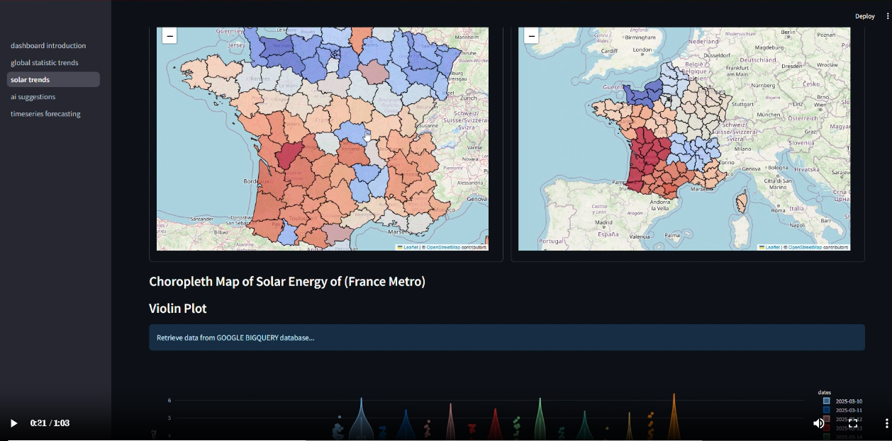

# Weather & Solar Energy Dashboard

[](https://streamlit.io/)
[](https://www.python.org/)
[](https://fastapi.tiangolo.com/)
[](https://www.docker.com/)

A Streamlit application for exploring weather and solar-energy data across French departments and regions. The dashboard consumes data from a separate REST API connected to the ClickHouse data warehouse; it does not connect directly to ClickHouse.

[](https://donat-konan33.github.io/assets/videos/demo.mp4)

The screenshot links to a short application demo.

## What the dashboard provides

| Section | Current capabilities |
| --- | --- |
| Weather statistics | Department-level temperature, feels-like, precipitation, wind, gust and pressure trends. |
| Weather analytics | Department or region views, today or the next three days, top or bottom rankings, geographic maps and KPI summaries. |
| Solar energy | Department and region maps, date-based solar-energy indicators, seven-day distribution charts and aggregated data. |
| Home energy planner | Estimates appliance energy use and autonomy from the selected department's available solar-energy data. |
| Forecasting | Navigation page is present, but advanced forecasting models are marked as coming soon and are not currently implemented in the dashboard. |

## Previous README and this update

| Previous README | Updated README |
| --- | --- |
| Described the dashboard broadly, without a clear breakdown of its pages. | Documents each available dashboard section and its current scope. |
| Presented an AI assistant and 15-day predictions as part of the experience. | No hosted LLM integration is required. This keeps the dashboard independent of usage-based AI charges; advanced forecasting remains planned rather than implemented. |
| Referred to environment variables and an `.env.example` file, although the app reads API settings from Streamlit secrets. | Gives the configuration format used by the application and identifies the API-key header. |
| Mentioned the backend without clearly separating it from this frontend repository. | Explains the Streamlit-to-REST-API-to-ClickHouse architecture and the backend prerequisite. |

This is a documentation comparison with the previous README, not a claim that each capability was newly introduced in a particular software release.

## Architecture

```text
Streamlit dashboard
	|
	| HTTPS/HTTP requests with X-API-Key
	v
REST API (separate backend project)
	|
	v
ClickHouse data warehouse
```

The data pipeline and API are maintained separately in the [ETLT Airbyte, MinIO, ClickHouse, dbt and Airflow project](https://github.com/donat-konan33/EtltAirbyteMinioClickhouseDbtAirflow). Start that backend and make its API reachable before using the dashboard.

## Requirements

- Python 3.12 for local development, or Docker with Docker Compose.
- Access to the REST API used by the dashboard.
- An API key accepted by that backend.

## Run locally

Clone the repository and enter its directory:

```bash
git clone https://github.com/donat-konan33/clickhouse-weather-analytics-dashboard.git
cd clickhouse-weather-analytics-dashboard
```

Create `.streamlit/secrets.toml` using the structure below. Replace the placeholders with the API base URL and API key supplied by your backend operator; do not commit real credentials.

```toml
[api]
BASE_URL = "https://your-api.example.com"
API_KEY = "your-api-key"
```

Install dependencies and start Streamlit:

```bash
poetry install
poetry run streamlit run "weatherdashboard/00_🏠_Home.py"
```

Open the local URL printed by Streamlit, normally `http://localhost:8501`.

## Run with Docker Compose

Create `.streamlit/secrets.toml` as shown above, then build and start the dashboard:

```bash
docker compose up --build -d
```

The dashboard is exposed on port `8501`. To stop it:

```bash
docker compose down
```

## Configuration

| Setting | Location | Purpose |
| --- | --- | --- |
| `api.BASE_URL` | `.streamlit/secrets.toml` | Base URL of the REST API. |
| `api.API_KEY` | `.streamlit/secrets.toml` | Key sent in the `X-API-Key` request header. |

The application performs a health check against the API when it starts. Keep credentials out of source control; `.streamlit/secrets.toml` is excluded by `.gitignore`.

The dashboard does not require an LLM provider or an AI-provider API key. AI-generated recommendations are not part of the current application, avoiding additional usage-based service costs.

## Project structure

```text
weatherdashboard/
├── 00_🏠_Home.py             # Dashboard landing page and API health check
├── functions/
│   ├── api_client.py         # REST API client
│   ├── constants.py          # Department, region and feature lists
│   ├── queries.py            # API-backed data access
│   └── state.py              # Session-state data caching
├── pages/                    # Weather, analytics, solar, energy and forecast pages
└── views/                    # Shared map and KPI visualizations
tests/                         # Automated tests
```

## Tests

Run the repository's configured test target with:

```bash
make test_connection
```

The tests cover the REST API client's health check, authenticated requests and error handling using mocks. They do not constitute end-to-end tests of the Streamlit pages or REST API.
